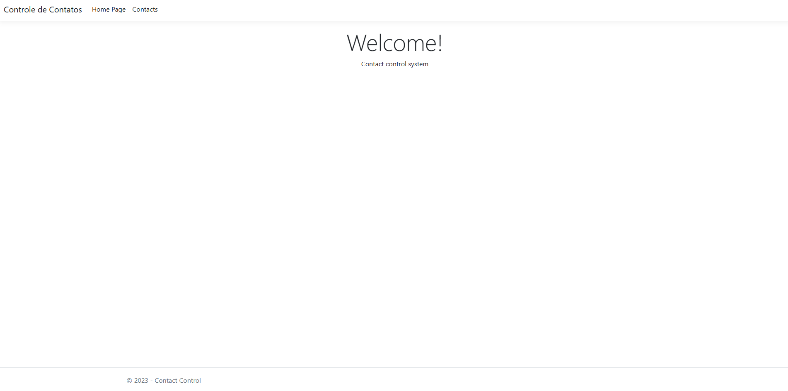

# Controle de Contatos

> Aprendendo C#

Projeto desenvolvido para iniciar o aprendizado em C# e ASP.NET Core. Sistema de gerenciamento de contatos que implementa operações CRUD completas, demonstrando conceitos fundamentais de desenvolvimento web com a linguagem C#.

Sistema de gerenciamento de contatos desenvolvido em ASP.NET Core MVC. Permite adicionar, editar, visualizar e excluir contatos com informações como nome, email e telefone. Interface responsiva construída com Bootstrap para uma experiência de usuário moderna e intuitiva.

[🔗 Clique aqui para acessar a página](https://ronald-ca.github.io/ControleDeContatos/)

## 📌 Tecnologias

- C#
- ASP.NET Core
- MVC
- Bootstrap
- HTML
- CSS
- Git e GitHub

## 📫 Contato

ronaldcamargodev@gmail.com 